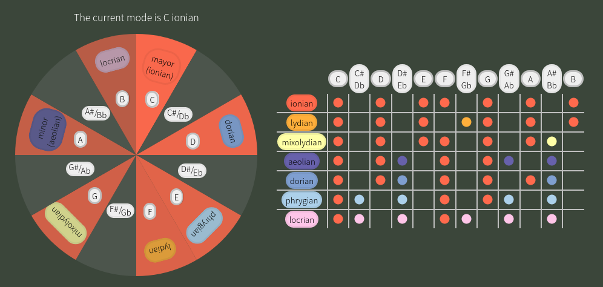
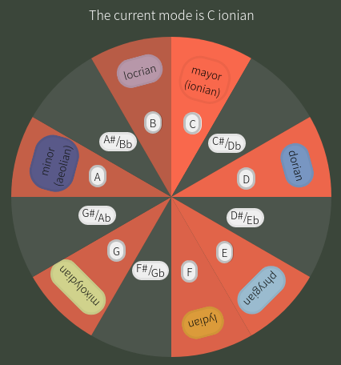
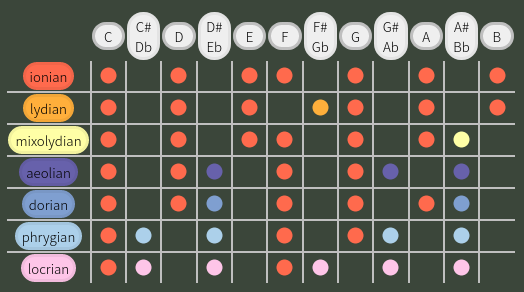

# :notes: Music Theory Web
This is a web entirely made with `React` and `SASS` to digitalize tools I usually use to understand and study music theory.

## :book: Built Look and How to Use

  

This web currently provides two different views of western music theory: the first one is the big circle atop the page, and the second one the table.

### :milky_way: Music Circle
This is the big circle atop the page, I choosed to call it _Music Circle_ given that it models the general idea of notes and modes in a straightforward way.  

  

By its center we have the twelve music notes in clockwise order, over the circle divided in twelve equal portions. The colored portions corresponds to the current mode selected, thus, each mode has its own color. In this case, the current mode is the ionic (or mayor key) given that all portions are of a redish color. If we read the circle clockwise from where the ionic mode button stands, we will find the intervals of said mode. At the same time, we have the corresponding notes arranged to those intervals, in this case starting with C.  
Is important to take notice that each mode can be seen as starting the intervals of the mayor scale (for example) from another point. For example, if we take said scale but we start reading clockwise from its second interval or note, we would have the intervals of the doric mode.  
Then, each mode button allows us to change modes, rotating the circle so that the selected mode appears atop the circle, or at twelve o'clock, and painting all corresponding portions to its color.  
Furthermore, we can rotate the inner notes circle, so that we can obtain any mode from any starting note.

### :scroll: Modes Table

This table represents the same idea as the circle, but viewed from a different vantage point.  

  

Each row represents a mode. We can see that each row has twelve cells, and the colored dots represent the intervals of each mode.  
Atop the table, we have as buttons the twelve music notes, allowing us to choose from which note as a starting point we are going to be reading the table.  
The predominant color of the dots is given by the current selected mode, in this case the ionic. This is to show which intervals, or notes, of the selected mode coincides with the intervals of each mode.  
Then, each colored dot that do not coincides with the main color is not present as an interval in the selected mode, and is painted with its corresponding mode color.

## :zap: Project Structure

The project has roughly the following structure:

- App
- Music Circle
- Modes
- Notes
- Modes Tables
- Other files
  - Scales
  - Tools

Where the `Music Circle` component has nested the `Modes` and `Notes` components, and `App` has both `Music Circle` and `Modes Table` components.  
The `Modes` and `Notes` components are similar given that both presents a circular shape with twelve partitions that rotate through the interaction with buttos. The rotating feature is made by rotating the data arrays of each model, function that can be found on the `Tools` file. Each of these components has its styling on the `music_circle.scss` file, where two different approachs to a circular shape are done via `SCSS` mixins, while the styling of the text box rightward of the circle is on `music_circle_section.scss`.  
The modes table is made with an html table, contained in the `Modes Table`, along all its logic.  
The `Scales` file contains all modes with pertinent information, as of now the modes relative to the _natural minor_ key. In the future, this file would store the information of the harmonic and melodic minor keys as well.

## :books: Other Tools

By this points the web is functional, and the main concern is making it more user friendly, but these are some features I would be adding in the future:

- Harmonic and Melodic Minors, and its relative modes
- Highlighting of Blues Scales on circle
- Chords Circle
- Circle of Fifths

Feel free to ask me anything!